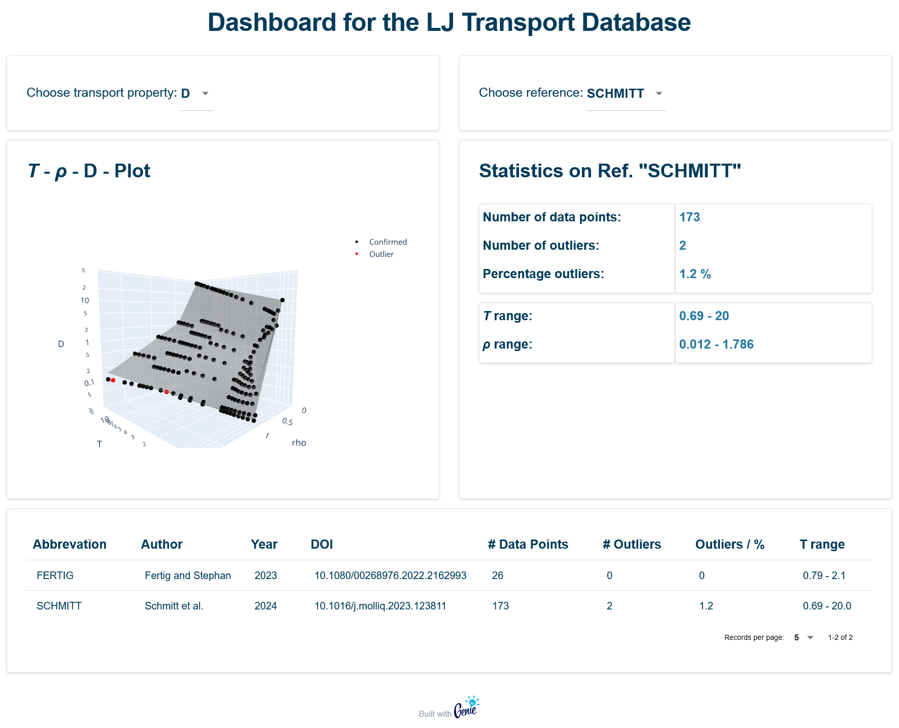

# LJ Transport Database Dashboard

Simple dashboard to work with a database containing compiled transport property data of the Lennard-Jones fluid from molecular dynamics simulations. The public repository only contains a demo database (as the actual database is not published yet).

## How to run app

Download the repository and start Julia.

```julia
cd("/directory/to/LJTransportDB")       # if not already in the directory

# Activate project and install all dependencies
import Pkg; Pkg.activate("./"); Pkg.instantiate()

# Then load Genie and start the app
using Genie

Genie.loadapp()
up()
```

Open http://127.0.0.1:8000 in your browser.

## Screenshot of the dashboard

